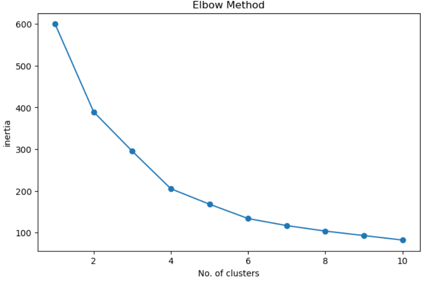
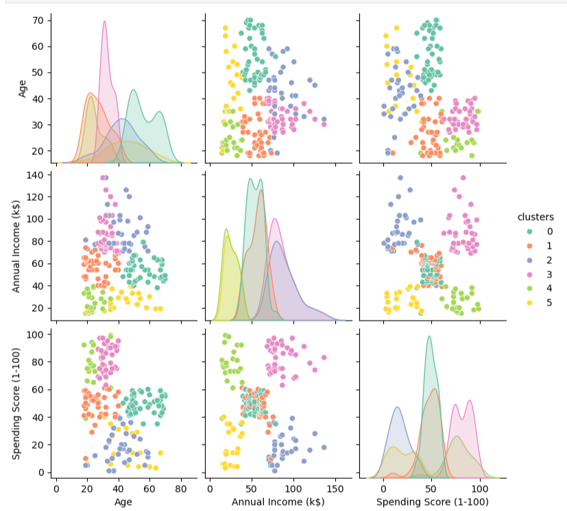
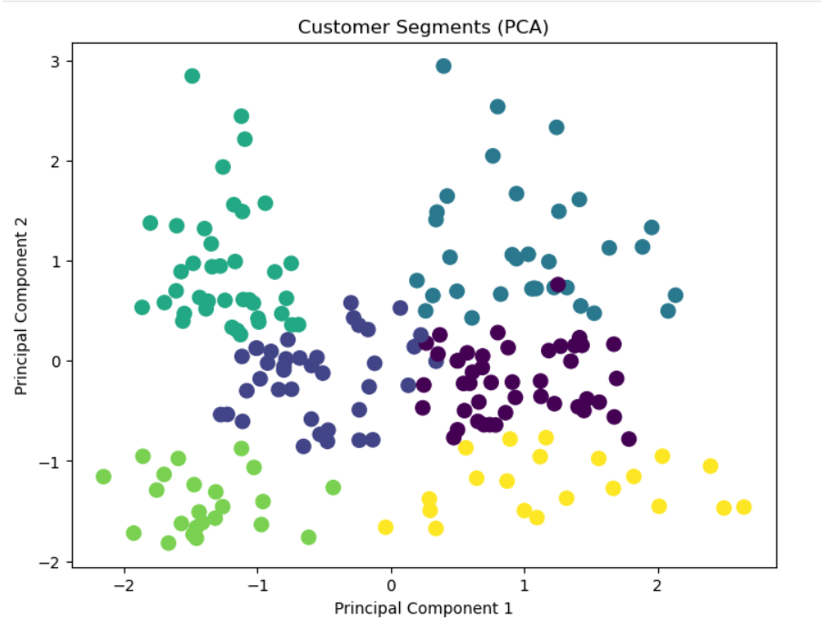

# Customer Segmentation using K-Means Clustering

Customer segmentation is one of the most common applications of **Unsupervised Machine Learning**. In this project, customers are grouped based on their purchasing behavior using the **K-Means Clustering** algorithm. The optimal number of clusters is determined using the **Elbow Method** and **Silhouette Score**, while **Principal Component Analysis (PCA)** is used to visualize the clusters in two dimensions.

---

## Project Overview

The goal of this project is to identify distinct customer segments that can help businesses:

- Design targeted marketing campaigns
- Improve customer retention
- Understand customer purchasing behavior
- Personalize promotions for different customer groups

---

## Dataset

**Source:** https://www.kaggle.com/datasets/vjchoudhary7/customer-segmentation-tutorial-in-python/data

The dataset contains **200 customer records** with the following features:

| Feature | Description |
|---------|-------------|
| CustomerID | Unique customer identifier |
| Gender | Male / Female |
| Age | Customer age |
| Annual Income (k$) | Annual income in thousand dollars |
| Spending Score (1-100) | Mall assigned spending score |

---

## Technologies Used

- Python
- Pandas
- NumPy
- Matplotlib
- Seaborn
- Scikit-learn

---

## Exploratory Data Analysis

The following analyses were performed before clustering:

- Dataset overview
- Statistical summary
- Missing value check
- Duplicate value check
- Unique value analysis
- Age group analysis
- Gender analysis
- Gender vs Age analysis
- Multi-chart visualization dashboard

---

## Data Preprocessing

The following preprocessing steps were applied:

- Selected relevant numerical features
  - Age
  - Annual Income
  - Spending Score
- Standardized features using **StandardScaler**

---

## Machine Learning Workflow

The clustering workflow consists of:

1. Feature Selection
2. Feature Scaling
3. Elbow Method
4. Silhouette Score
5. K-Means Clustering
6. Cluster Analysis
7. PCA Visualization
8. Cluster Center Interpretation

---

## Elbow Method

The Elbow Method was used to determine the optimal number of clusters by analyzing the Within Cluster Sum of Squares (WCSS).



---

## Silhouette Score

The Silhouette Score was calculated for different values of **K**.

The highest score was obtained for:

- **K = 6**
- **Silhouette Score ≈ 0.428**

This confirmed that six customer segments provided the best clustering performance.

---

## PCA Cluster Visualization

Principal Component Analysis (PCA) reduced the three-dimensional feature space into two principal components for visualization.




---

## 🔍 Pairplot of Customer Segments

The pairplot below illustrates the relationship between Age, Annual Income, and Spending Score while highlighting the discovered customer segments.



---

## Cluster Analysis

Each customer was assigned to one of six clusters.

The average customer profile for every cluster was calculated using:

- Average Age
- Average Annual Income
- Average Spending Score

This helps businesses understand the characteristics of each customer segment.

---

## Results

- Successfully segmented customers into **6 distinct clusters**
- Used both Elbow Method and Silhouette Score for model selection
- Visualized clusters using PCA
- Generated interpretable customer segments for business analysis

---

## Repository Structure

```
Customer-Segmentation/
│
├── Customer_Segmentation.ipynb
├── Mall_Customers.csv
├── README.md
│
├── images/
│   ├── elbow_method.png
│   ├── pairplot.png
│   └── pca_clusters.png
│
└── requirements.txt
```

---

## Future Improvements

- Hierarchical Clustering
- DBSCAN Clustering
- Interactive visualizations using Plotly
- Customer profiling dashboard
- Cluster comparison using additional metrics

---

## Author

**Tushar Panging**

If you found this project useful, feel free to ⭐ this repository.
